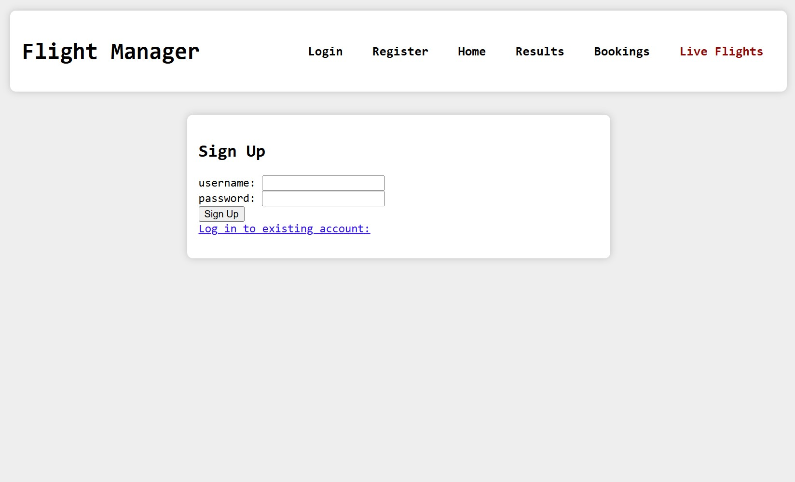
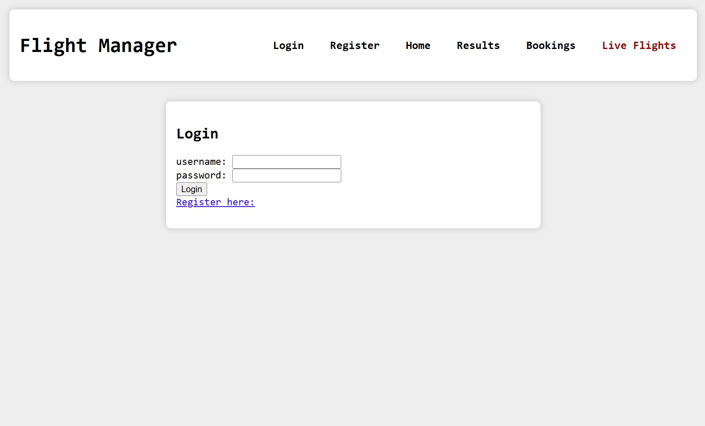
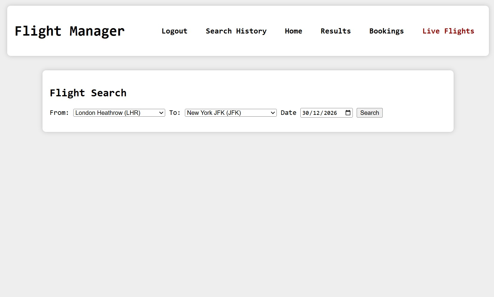
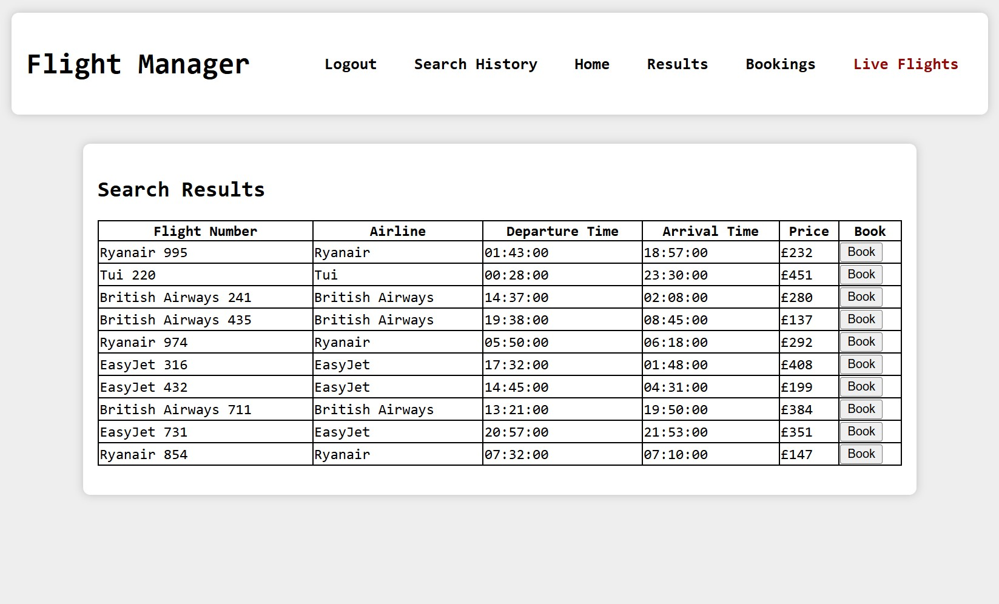
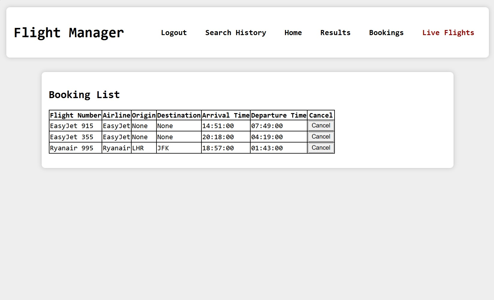
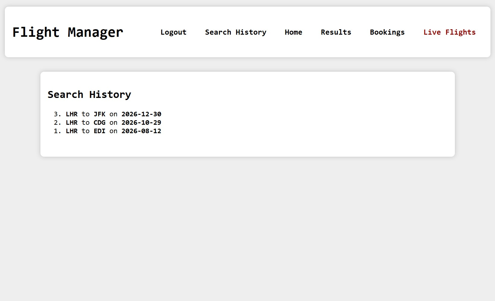
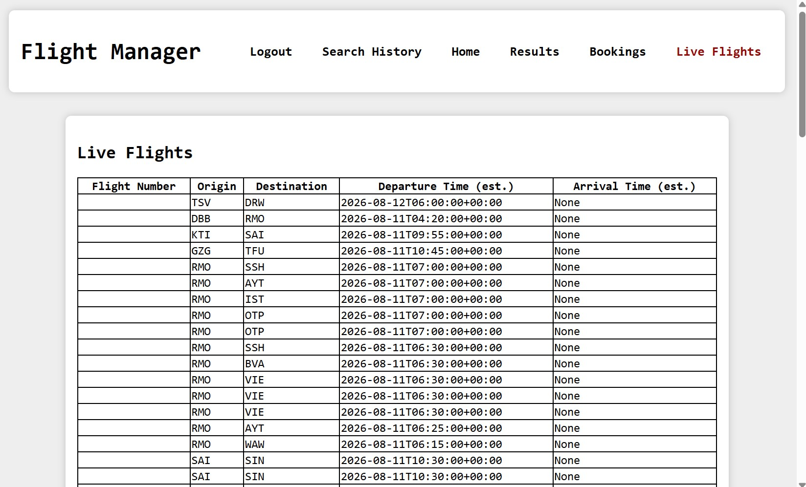

# Flight-Manager

## Overview

Flight Manager is a full-stack flask-based web application project that provides the following features:
- Searching and booking of generated flights using a mock api
- List of (real) live flights providing departure and arival airports and esimated timings using the AviationStack free API plan
- Login + Sign up account authentication system
- Account-exclusive bookings and search history management

## Project Setup

### Virtual Environment

Terminal command to create the virtual environment:

`python -m venv .venv`

Terminal command to activate the virtual environment:

`.venv\Scripts\activate`

### Dependencies

Terminal command to install the required dependencies:

`pip install -r requirements.txt`

### API

Terminal command to set AviationStack API key (replace placeholder text in " " with key):

`$env:AVIATIONSTACK_API_KEY="api_key"`

### PYTHONPATH

Terminal command to set the root path:

`$env:PYTHONPATH = "C:\...\Flight_Manager"`

Replace "..." in command with directory path up until "FLight_Manager"
(Have to repeat this command every time the project is re-opened as
is not saved even if the venv is).

### Flask

Terminal command to initialise the database:

`flask --app app init-db`

Terminal command to run the application:

`flask --app app run`

## Features

### Live Flights (API Integration)

The Live Flights feature uses the AviationStack API to show a list of live flights in a table including flight number, origin and destination airport IATA as well as estimated departure and arrival times. This feature can be accessed through the "live" route.

### Flight Booking (Using Mock API)

The Flight Booking feature allows users to enter flight details such as "From" and "To" airports and a departure date as well as a search button. If the form fields are all entered and search button pressed a table of (theoretical) flights are generated using a mock API. One of the table columns allows for the flights to be booked and added to the specific user's (account) bookings. These bookings can then be seen in the "bookings" route and cancelled/deleted.

### Authentication and Security

Account system allowing users to log in given a valid username and password are provided. Also allows users to register an account by providing wanted username and password. Passwords are hashed before being stored in the database to ensure account security.

API key stored as an environment key to avoid hard
coding one into the project, protects keys from being used by unwanted third parties.

### Database

An SQLite database is used to store users as well as user-specific tables: bookings and search history.

## Screenshots
### Register Page

### Login Page

### Home Page

### Results Page

### Bookings Page

### Search History Page

### Live Flights Page

## Project Directory

```mermaid
graph TD
    A[FLIGHT_MANAGER]

    %% Root-level Python modules
    A --> A1[app.py]
    A --> A2[auth.py]
    A --> A3[booking_list.py]
    A --> A4[config.py]
    A --> A5[search_history.py]
    A --> A6[schema.sql]

    %% Database
    A --> DB[database/]
    DB --> DB1[__init__.py]
    DB --> DB2[db.py]

    %% Services
    A --> S[services/]
    S --> S1[mock_flight_api.py]
    S --> S2[real_flight_api.py]

    %% Templates
    A --> T[templates/]
    T --> T1[base.html]
    T --> T2[index.html]
    T --> T3[live.html]
    T --> T4[results.html]
    T --> T5[booking_list.html]
    T --> T6[search_history.html]
    T --> T7[login.html]
    T --> T8[register.html]
    T --> TA[auth/]
    TA --> TA1[login.html]
    TA --> TA2[register.html]

    %% Static
    A --> ST[static/]
    ST --> ST1[styles.css]

    %% Tests
    A --> TS[tests/]
    TS --> TS1[conftest.py]
    TS --> TS2[test_auth.py]
    TS --> TS3[test_booking_list.py]
    TS --> TS4[test_db.py]
    TS --> TS5[test_factory.py]
    TS --> TS6[test_mock_flight_api.py]
    TS --> TS7[test_real_flight_api.py]
    TS --> TS8[test_search_history.py]
    TS --> TS9[test_conftest.py]

    %% Docs
    A --> D[docs/]
    D --> D1[docstrings/]
    D --> D2[application_docs/]
    D --> D3[test_docs/]
    D --> D4[screenshots/]
    D --> D5[testing.md]

    %% Screenshots
    D4 --> SC1[home_page.jpg]
    D4 --> SC2[login_page.jpg]
    D4 --> SC3[register_page.jpg]
    D4 --> SC4[booking_page.jpg]
    D4 --> SC5[live_page.jpg]
    D4 --> SC6[results_page.jpg]
    D4 --> SC7[search_history_page.jpg]
    D4 --> SC8[DBSchema.jpg]

    %% Misc
    A --> M1[instance/]
    A --> M2[.gitignore]
    A --> M3[LICENSE]
    A --> M4[README.md]
    A --> M5[requirements.txt]
```

## Known Issues
- AviationStack API free tier appears to often
have missing data: Cannot find flight numbers
and estimated arrivals are often missing.

- API calls on current plan limited to 100 per month.

- Mock data has to be used for booking non-live flights as no free APIs seem to offer historical
or future flight data, only live.

## Potential Future Improvements
- Switch API to one (most likely a paid offering) that
offers historical and future flight data as well as live data which also provides that data more consistently.

- Replace SQlite database to a PostgreSQL or MySQL
one which utilises a server to avoid it being stored
locally, mandatory for production.

- Add caching to avoid wasting another API call if
searching with identical parameters.

- Containerise (Docker) as project is tedious to set up.