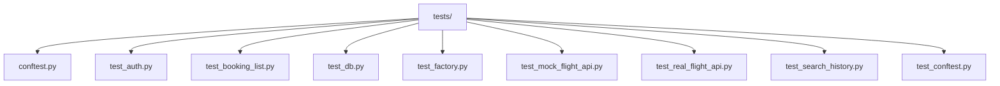

# Testing Info
## Running Tests
- Use the terminal command: `pytest` to run all
tests together

- Use the terminal command: `pytest tests/test_file_name.py`
to run the tests for a specific python file (replace "file_name" with that of the target file)

- Use the terminal command: `pytest -k "keyword"`
to run tests which names contain the expression
given in " " (eg. Login, Register)

## Testing Breakdown

### Structure

### Dependencies
- Pytest: Overarching testing framework

- unittest.mock: Used to replicate API calls
(prevents real API calls from being wasted)

### Flask Test Configuration
The conftest.py file in the `tests/` directory creates
a Flask application instance with the test configuration. This alternate configuration is completley independent of the default one to allow
for isolated testing that will not affect the production application instance. It also creates a
database with identical schema to the production one which also helps keep the testing isolated by storing data used by tests in a different location.

Un-logged in and logged-in clients are created for the
test configuration using Pytest fixtures to emulate
HTTP requests (GET and POST).

### API Call Mocks
Dependency unittest.mock used to mock calls to the
AviationStack API via the RealFlightAPI wrapper. A
mock response stored locally in `tests/test_real_flight_api.py` is used in place of the
actual API, it stores example data that would be recieved from the real API sourced from the AviationStack documentation with altered data
in the needed fields. This also removes the need for an API key to run the tests as a local test-specific one is created for mocked usage.